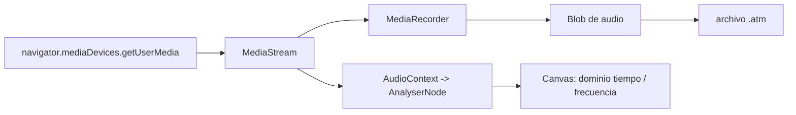
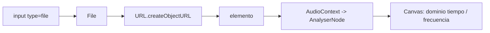

# Investigación: captura de audio por streaming y lectura de archivos WAV en JavaScript 

# Está investigación está apoyada utilizando anthropic claude Sonnet 5 eficacia media, yo el estudiante Kevin Alonso Espinoza Barrantes afirmo ser parte de la investigación que doy a continuación

## 1. Captura de audio por streaming (micrófono)

### 1.1 Enfoque nativo del navegador — Web Audio API + MediaRecorder

- **`getUserMedia({ audio: true })`** entrega un `MediaStream` del micrófono.
- **`MediaRecorder`** sobre ese mismo `MediaStream`, es el mecanismo estándar para resolver el requisito de "almacenar el audio si es streaming, con inicio/detención/continuación": expone eventos como `ondataavailable` (que va entregando fragmentos del audio grabado) y `onstop` (donde esos fragmentos se combinan en un único `Blob`). El control de pausa/reanudación se logra con sus métodos propios sin necesidad de manejar manualmente el buffering de muestras.
- Para la parte de **visualización en tiempo real** (graficar simultáneamente el dominio del tiempo y de la frecuencia), el mismo `MediaStream` puede conectarse en paralelo a un `AudioContext` y de ahí a un `AnalyserNode`, el cual permite tomar la información generada, procesarla y crear visualizaciones de audio, copiando los datos en un arreglo donde cada elemento representa el valor en decibeles de una frecuencia específica<cite index="36-1,32-1">, al ser un nodo que pasa el audio sin alterarlo pero permite extraer datos de dominio de tiempo o frecuencia para dibujarlos, por ejemplo con getByteFrequencyData() o getFloatFrequencyData()</cite>. Internamente el nodo aplica una ventana Blackman antes de la FFT para reducir la fuga espectral, y los datos de frecuencia en bytes se escalan por defecto entre -100 y 0 dBFS<cite index="33-1">, rango que se refleja en el eje de nivel calibrado y que permite convertir cada byte de vuelta a dBFS</cite>.
- En lugar de escribir manualmente el bucle de dibujo (`requestAnimationFrame` + lectura del `AnalyserNode` + pintar en un `<canvas>`), una alternativa habitual en proyectos con interfaces React es apoyarse en un **hook/librería de visualización de audio para React** construido encima de Web Audio API + Canvas. Este tipo de utilidades exponen típicamente una referencia a un elemento `<canvas>`, funciones `start()`/`stop()`, y la posibilidad de indicar como *fuente* tanto el micrófono en vivo como un elemento `<audio>` ya existente — logramos evitar reimplementar el `AnalyserNode` y el ciclo de renderizado a mano, y ofreciendo de fábrica distintos modos de representación (por ejemplo espectro de barras u onda) y parámetros configurables como el tamaño de la FFT o el suavizado entre cuadros.

### 2.2 Alternativas en Node.js (no se si elegiremos una app de consola)

| Opción | Cómo funciona | Contras relevantes |
|---|---|---|
| `mic`, `node-microphone`, `node-record-lpcm16` | Ejecutan como *child process* binarios externos (SoX o ALSA `arecord`) y exponen un stream de Node | Requieren instalar SoX/ALSA por sistema operativo; no dan FFT ni visualización — solo bytes crudos |
| `node-web-audio-api` (bindings Rust/napi) | Implementación conforme al spec de Web Audio API corriendo nativamente en Node (incluye `AnalyserNode`, `MediaStreamAudioSourceNode`, etc.)<cite index="12-1">, mediante bindings de Node.js para la implementación en Rust de la especificación Web Audio API</cite> | Requiere paso de compilación nativa y, en Linux, la librería `libasound2-dev`<cite index="12-1">para poder construirla</cite> |
| `web-audio-api` (polyfill puro JS + `audio-mic`) | Permite que código de navegador (`getUserMedia`, `AudioContext`) corra "tal cual" en Node<cite index="14-1">, instalando un polyfill de navigator.mediaDevices.getUserMedia respaldado por el paquete opcional audio-mic</cite> | Proyecto más joven; DSP pesado es más lento que la versión en Rust |

**Conclusión parcial:** dado que la app la planteamos como una app web, el par `getUserMedia` + `MediaRecorder` (para capturar/almacenar) junto con un `AudioContext`/`AnalyserNode` (para visualizar), ya sea escrito a mano o mediante un hook que lo encapsule, cubre por completo el requisito sin dependencias nativas del sistema operativo. La ruta de Node.js puro queda como alternativa teórica únicamente si se migrara a una app de escritorio/consola.

## 3. Carga y visualización de archivos WAV existentes

- Un enfoque teórico más simple que decodificar manualmente el archivo es delegar la reproducción al propio navegador: a partir de un `<input type="file" accept="audio/*">` se obtiene un objeto `File`, y con **`URL.createObjectURL(archivo)`** se genera una URL local que puede asignarse directamente como `src` de un elemento HTML `<audio controls>`. El navegador se encarga de decodificar y reproducir el WAV (u otros formatos soportados) sin que la aplicación tenga que leer el header RIFF ni manejar el `ArrayBuffer` a mano.
- Para graficar ese archivo en el dominio del tiempo y de la frecuencia, la misma pieza de visualización usada para el micrófono (el `AnalyserNode`, directo o a través de un hook) puede conectarse en este caso usando como *fuente* el propio elemento `<audio>` (vía `MediaElementAudioSourceNode`) en lugar del `MediaStream` del micrófono. Esto permite reutilizar exactamente el mismo componente/lógica de dibujo tanto para audio en vivo como para audio cargado desde archivo, arrancando la visualización cuando el elemento `<audio>` dispara su evento `play` y deteniéndola en `pause`/`ended`.
- **Alternativa formal (no usada aquí pero relevante para la teoría):** `AudioContext.decodeAudioData(arrayBuffer)` es el método "de bajo nivel" recomendado cuando se necesita acceso directo a las muestras PCM (por ejemplo para extraer armónicos específicos o comparar por potencia), ya que decodifica el archivo completo de forma asíncrona y devuelve un `AudioBuffer` del cual se puede leer cada canal con `getChannelData()`<cite index="26-1">, siendo el método preferido para crear una fuente de audio a partir de una pista, aunque solo funciona sobre datos de archivo completos, no fragmentos</cite>. Su limitación principal es que, al operar sobre el archivo completo, un WAV muy largo puede agotar memoria durante la decodificación<cite index="29-1">, existiendo como workaround dividir el archivo en fragmentos pequeños para pasarlos uno a uno a decodeAudioData</cite>; para los tonos y frases cortas que pide la tarea esto no debería representar un problema, y de necesitarse acceso a las muestras crudas (para el Comparador) este sería el camino a investigar en detalle más adelante.

## 4. Exploración/zoom sobre la visualización

Para la funcionalidad de explorar los gráficos mediante zoom in and zoom out del Reproductor, una técnica sencilla a nivel de interfaz (sin tocar la lógica) es envolver el `<canvas>` en un contenedor con overflow controlado y aplicar una transformación CSS de escala (`transform: scale(factor)`) sobre su contenido, ajustando ese factor en respuesta al evento `wheel` del mouse (con `preventDefault()` para evitar el scroll normal de la página). Esto desacopla el "zoom" de la señal de audio en sí: la escala visual cambia, pero los datos que alimenta el `AnalyserNode` siguen siendo los mismos.

## 5. Consideraciones para el diseño de Autrum

1. **Reutilizar un mismo bloque de visualización (Web Audio API + Canvas) tanto para el micrófono como para el archivo cargado** simplifica el desarrollo: basta con cambiar la *fuente* que se conecta al `AnalyserNode` (`MediaStream` del micrófono vs. `MediaElementAudioSourceNode` del `<audio>`), sin duplicar la lógica de dibujo — esto es clave porque el Reproductor debe mostrar los mismos gráficos que el Analizador.
2. El **control de start/stop/pause/resume** del streaming se resuelve de forma nativa con `MediaRecorder`, sin necesidad de lógica extra.
3. Delegar la carga de WAV a un elemento `<audio>` + `URL.createObjectURL` es suficiente para reproducir y visualizar, pero **no da acceso directo a las muestras PCM**, si el Comparador necesita analizar la señal fuera de tiempo real, tendre que investigar por separado el uso de `decodeAudioData` u otra vía de acceso a los datos crudos.
4. Para el **archivo `.atm`**, guardar junto al audio original los datos ya calculados de frecuencia, evitando calcular otra y otra vez cada vez que se reproduce.
5. Quedo pendiente investigar el algoritmo de extracción de armónicos específicos (partes del audio en especifico) y la comparación.
